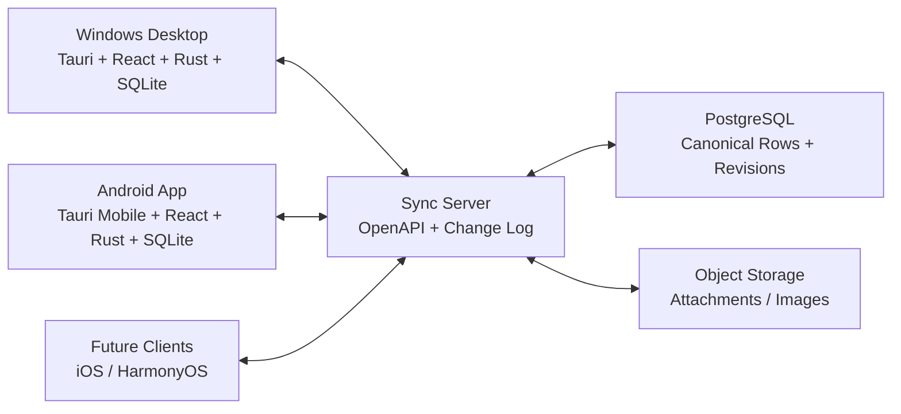

# TodoFlow Android 迁移 SDD 实施计划书

版本：v0.1
适用范围：TodoFlow v0.5.0 桌面端迁移到 Android App，并为后续 iOS、鸿蒙扩展预留架构空间。
编写目标：给 coding agent 分发实施任务。本文不是产品宣传稿，而是规格驱动开发的执行蓝图。

## 1. 背景与目标

TodoFlow 当前是成熟的 Windows 桌面任务清单软件，技术栈为 Tauri v2 + React 19 + TypeScript + Rust + SQLite。桌面端已具备任务、子任务、标签、日历、我的一天、四象限、看板、习惯追踪、富文本描述、附件、提醒、番茄钟、悬浮窗、多主题、统计看板、搜索、命令面板等能力。

Android 迁移不能简单压缩桌面界面。移动端用户的使用场景更碎片化，主要行为是快速捕获、今日查看、勾选完成、设置提醒、查看日程、习惯打卡、短时专注。桌面端强调宽屏多视图和键盘效率，移动端应强调单手、触控、离线、通知、手势、低打扰和高审美。

最终目标：

- Android App 可独立离线使用。
- 桌面端与 Android App 能双向同步任务、标签、习惯、提醒、设置和必要附件。
- 移动端体验符合 Android 用户习惯，不照搬桌面侧边栏、右键菜单、悬浮窗、宽屏分栏等行为。
- 基本保留桌面端功能完整性，同时把不适合首版移动端的能力降级、延后或移动化重构。
- 每个阶段都可独立发布、独立验收、独立回滚。
- 同步协议、领域模型、接口契约与 UI 层解耦，为 iOS、鸿蒙或其他客户端复用。

## 2. 推荐技术路线

### 2.1 首选路线

建议首版 Android 采用：

- App 壳：Tauri v2 Mobile Android。
- UI：React + TypeScript，建立移动端专用页面和组件，不复用桌面布局组件。
- 本地数据库：SQLite，优先复用 Rust 数据层和 migrations，补充移动端兼容适配。
- 状态管理：继续使用 TanStack Query + Zustand，但增加平台无关 repository 接口。
- 同步服务：独立 Sync Server，建议 Rust Axum + PostgreSQL + 对象存储；也可用 TypeScript Fastify/NestJS，但必须遵守 OpenAPI 与同步协议。
- 接口契约：OpenAPI + JSON Schema + 版本化 sync contract。

选择理由：

- 当前桌面端已是 Tauri v2 + React + Rust，Tauri 官方支持使用任意前端框架构建桌面和移动端应用，复用成本最低。
- React 组件和业务 hooks 可部分复用，但移动端必须新建 layout、navigation、gesture、detail sheet 等触控体验。
- Rust 数据层、SQLite schema、任务模型和现有命令可以逐步抽象为跨端核心能力，避免完全重写。
- 未来 iOS 可沿用 Tauri v2 Mobile；鸿蒙可通过同一同步协议接入，必要时单独实现 ArkUI/ArkTS 客户端。

### 2.2 备选路线

如果 Tauri Android 在实际设备上出现不可接受的问题，例如 WebView 性能、通知能力、后台任务、输入法、文件选择或系统集成受限，则启动备选路线：

- Android UI 改为 Kotlin + Jetpack Compose。
- 领域模型与同步协议保持不变。
- 本地数据库使用 Room 或 SQLDelight。
- Rust/TS 业务逻辑不直接复用，只复用规格、API、测试用例和同步协议。

### 2.3 明确不建议的路线

不建议直接把桌面端 React 页面做响应式压缩后塞进 Android。这样短期看似快，长期会导致：

- 右键、hover、键盘快捷键、宽屏详情面板等交互在手机上失效。
- 日历、看板、矩阵、富文本编辑器的可用性下降。
- 同步能力与 UI 改造耦合，后续 iOS/鸿蒙成本更高。

## 3. SDD 工作方式

所有 coding agent 必须先实现规格，再实现代码。规格文件建议新增在 `specs/mobile/`：

```text
specs/mobile/
  00-product-scope.md
  01-domain-model.md
  02-sync-protocol.md
  03-mobile-ux.md
  04-api-contract.openapi.yaml
  05-storage-migrations.md
  06-test-plan.md
  adr/
    0001-mobile-tech-stack.md
    0002-sync-strategy.md
    0003-mobile-design-system.md
```

开发规则：

- 任何跨端字段变更必须先更新 `01-domain-model.md` 和迁移文档。
- 任何同步行为变更必须先更新 `02-sync-protocol.md` 和 OpenAPI。
- 任何移动端交互变更必须先更新 `03-mobile-ux.md`。
- 每个阶段都必须有验收清单、测试用例和截图。
- agent 只能实现自己负责的模块，跨模块依赖通过规格和契约对齐。

## 4. 现有桌面端能力盘点

### 4.1 必须迁移到移动端首批核心

- 任务创建、编辑、删除、完成、恢复。
- 子任务查看、创建、完成、删除，保持两级嵌套。
- 优先级、截止日期、具体时间。
- 多提醒。
- 标签与父子标签。
- 我的一天。
- 今日、全部、未完成、已完成、逾期筛选。
- 搜索。
- 习惯打卡。
- 基础统计。
- 浅色、深色、浮光主题。
- 本地 SQLite 离线使用。
- 桌面端与移动端双向同步。

### 4.2 移动端重构后迁移

- 日历：桌面月/周/日完整视图，移动端首版改为“周条 + 日程列表”，月视图放二级入口。
- 四象限：桌面四格同时展示，移动端改为分段切换或 2x2 可缩放卡片。
- 看板：桌面多列拖拽，移动端改为横向列切换、分组列表或简化拖拽。
- 富文本：移动端首版保留渲染和基础编辑，图片、表格、高级格式放后续阶段。
- 附件：首版可查看附件元信息，上传/预览/缩略图异步补齐。
- 番茄钟：桌面独立悬浮窗改为移动端专注页 + 前台通知 + 系统通知控制。

### 4.3 不应照搬到移动端

- 桌面侧边栏常驻布局。
- 右键菜单。
- hover 显示控制。
- 键盘命令面板作为主入口。
- Windows 系统托盘。
- 桌面悬浮气泡窗口。
- 可拖拽宽屏详情面板。

这些能力应以 Android 语义重做：底部导航、长按菜单、底部操作表、滑动操作、通知、主屏小组件、系统分享入口。

## 5. 移动端产品结构

### 5.1 底部导航

建议首版 5 个主入口：

1. 今天：今日到期、我的一天、逾期入口、快速完成。
2. 任务：全部、标签、筛选、搜索。
3. 日历：周条 + 日程列表，月视图二级入口。
4. 习惯：今日习惯打卡、连续记录。
5. 我的：同步状态、主题、设置、数据管理。

如果底部导航希望更克制，可将“习惯”放入“我的”，首版保留 4 个入口。

### 5.2 全局快速添加

移动端必须有常驻快速添加能力：

- 主界面 FAB，点击打开 bottom sheet。
- 支持输入标题后回车/确认创建。
- 可快速设置日期、时间、提醒、标签、优先级、我的一天。
- 支持自然语言解析作为增强能力，例如“明天下午三点交报告 #工作 !高”。
- 支持系统分享入口：从其他 App 分享文字到 TodoFlow 创建任务。

### 5.3 任务列表交互

- 点击任务卡片：打开任务详情 bottom sheet 或全屏详情页。
- 点击圆形勾选：完成/恢复。
- 左滑：完成或归档。
- 右滑：安排日期或加入我的一天。
- 长按：进入多选或打开操作表。
- 下拉：触发同步。
- 顶部：搜索、筛选、排序入口。
- 离线状态：列表仍可编辑，状态栏显示“离线修改待同步”。

### 5.4 任务详情

桌面端详情面板迁移为：

- Android 手机：全屏详情页或 80% 高度 bottom sheet。
- Android 平板/折叠屏：可使用双栏，但必须是自适应布局，不影响手机体验。
- 详情字段顺序：标题、状态快捷操作、日期/提醒/标签/优先级、子任务、描述、附件、创建/更新时间、危险操作。
- 自动保存保留，但移动端必须明确显示保存状态：已保存、本地待同步、同步失败。

### 5.5 移动端日历

首版推荐：

- 默认展示一周横条，下面是按时间排序的任务列表。
- 月视图放右上角切换入口。
- 日期点显示任务数量和逾期标记。
- 点击日期进入当天任务。
- 长按日期快速创建该日期任务。

### 5.6 习惯

首版推荐：

- 首页展示今日习惯卡片。
- 一键打卡，支持目标计数。
- 展示当前连续天数、最佳连续天数、近 7 天简图。
- 复杂热力图放后续阶段。

### 5.7 番茄钟

桌面端番茄钟有独立悬浮窗和全屏沉浸，移动端应改为：

- 专注页：大圆环、当前任务、暂停/跳过/结束。
- 前台通知：显示剩余时间和控制按钮。
- 阶段切换通知：专注结束、短休、长休。
- 首版不做悬浮窗覆盖层，避免 Android overlay 权限带来的打扰和审核风险。
- 后续可做主屏小组件和快捷磁贴。

## 6. 视觉与审美规格

移动端不是桌面端缩小版，应建立 TodoFlow Mobile Design System。

### 6.1 视觉关键词

- 清醒：信息层级明确，任务状态一眼可见。
- 温润：降低工具感，减少冷冰冰的表格气质。
- 轻盈：卡片、分割、阴影克制，避免过度装饰。
- 有秩序：日期、优先级、标签、完成状态有稳定视觉语言。
- 有艺术成分：主题、动效、空状态、专注页有精致表达，但不喧宾夺主。

### 6.2 色彩

保留桌面端核心气质，但移动端避免单一紫色统治：

- Primary：延续 `#7C72F6`，只用于主操作、选中态、焦点态。
- Success：完成、习惯打卡使用柔和绿色。
- Warning：逾期、临近截止使用琥珀或橙色。
- Danger：删除、放弃使用红色。
- Neutral：正文和背景使用灰蓝、暖灰，不使用纯黑纯白作为大面积基础。

首版主题：

- Light：默认明亮主题。
- Dark：夜间主题。
- Lumina：移动端高级亮色主题。

后续主题：

- Warm：适合夜间和长时间规划。
- Glass：仅在性能和可读性验证通过后再做，不作为首版主线。

### 6.3 组件规范

- 卡片圆角建议 8 到 10px，任务卡不要过圆。
- 底部导航使用图标 + 短标签。
- FAB 使用图标按钮，打开快速添加 bottom sheet。
- 优先级使用旗帜图标和颜色点，不用大面积色块。
- 标签使用小胶囊，但数量多时折叠。
- 日期使用短文本，例如“今天 17:30”“明天”“7月12日”。
- 操作按钮优先使用图标，必要时附短标签。
- 空状态使用轻量插画或动态形态，但不能占据过多空间。
- 动效时长 150 到 280ms，页面切换和 bottom sheet 动画必须流畅。

### 6.4 无障碍

- 触控目标不小于 44dp。
- 正文文本不小于 14sp。
- 支持系统字体缩放。
- 深色主题对比度达标。
- 勾选、删除、同步失败必须有视觉和文本反馈。

## 7. 数据与同步方案

### 7.1 同步原则

TodoFlow 应采用 local-first 架构：

- 每个客户端都有完整本地 SQLite 数据库。
- 离线时所有核心操作可用。
- 操作先写本地，再进入同步队列。
- 恢复网络后后台推送本地变更并拉取远端变更。
- 冲突按明确规则自动合并，无法合并时保留冲突副本或提示用户。

### 7.2 同步架构



### 7.3 客户端新增表

建议在桌面端和移动端 SQLite 中新增：

```sql
sync_meta(
  key TEXT PRIMARY KEY,
  value TEXT NOT NULL
);

sync_operations(
  op_id TEXT PRIMARY KEY,
  entity_type TEXT NOT NULL,
  entity_id TEXT NOT NULL,
  operation TEXT NOT NULL,
  base_revision INTEGER,
  payload TEXT NOT NULL,
  client_time TEXT NOT NULL,
  device_id TEXT NOT NULL,
  status TEXT NOT NULL,
  retry_count INTEGER NOT NULL DEFAULT 0,
  last_error TEXT
);

sync_conflicts(
  id TEXT PRIMARY KEY,
  entity_type TEXT NOT NULL,
  entity_id TEXT NOT NULL,
  local_payload TEXT NOT NULL,
  remote_payload TEXT NOT NULL,
  created_at TEXT NOT NULL,
  resolved_at TEXT
);
```

同时给主要业务表新增同步字段：

- `deleted_at TEXT`
- `server_revision INTEGER`
- `local_revision INTEGER`
- `last_modified_device_id TEXT`
- `sync_status TEXT`

主要业务表包括：

- `tasks`
- `task_reminders`
- `tags`
- `attachments`
- `habits`
- `habit_logs`
- `settings` 中的可同步设置子集

### 7.4 实体同步范围

首批同步：

- tasks
- task_reminders
- tags
- habits
- habit_logs
- syncable_settings

第二批同步：

- attachments metadata
- attachment binary
- rich text embedded images
- pomodoro history

不建议同步或仅设备本地保存：

- 桌面窗口位置。
- 桌面悬浮窗位置。
- 桌面快捷键。
- Android 通知权限状态。
- Android 小组件布局。
- 当前番茄钟运行中的秒级状态。

### 7.5 冲突解决规则

必须写入 `specs/mobile/02-sync-protocol.md`。

推荐规则：

- 标题、优先级、截止日期、标签、我的一天：字段级 last-write-wins，使用 server accepted time + device logical clock。
- 完成状态：最后一次状态变更生效，同时保留 `updated_at`。
- 子任务层级：若父任务被删除，子任务按现有语义级联删除；若远端移动父级、本地编辑标题，合并父级与标题。
- 排序：不要用连续整数作为跨端排序唯一依据。同步层应使用 fractional sort key 或 LexoRank；现有 `sort_order` 可作为本地兼容字段。
- 标签集合：标签自身是实体，任务只引用 `tag_id`。标签删除后任务 `tag_id` 置空。
- 多提醒：按 reminder id 合并，新增和删除互不覆盖。
- 习惯日志：以 `habit_id + log_date` 为唯一业务键，计数取最后修改值；未来可支持增量操作。
- 富文本描述：首版采用字段级 last-write-wins，并在冲突时保留副本。后续再引入富文本 CRDT。
- 删除：使用 tombstone。远端删除和本地编辑冲突时，默认删除优先，但保留冲突记录供恢复。

### 7.6 附件与富文本图片

当前富文本描述可能包含 data URL 图片。移动端同步时必须避免把巨大 base64 HTML 反复上传。

建议阶段性处理：

1. 首版保留 HTML 字段同步，但限制单条描述大小并警告。
2. 第二阶段新增内容寻址附件：`sha256`、`mime_type`、`size`、`storage_key`。
3. 富文本中的图片迁移为内部资源引用，例如 `todoflow-attachment://attachment_id`。
4. 客户端渲染时映射到本地缓存文件或远端临时 URL。
5. 二进制附件独立异步上传下载，不阻塞任务元数据同步。

### 7.7 提醒同步

提醒本质是任务数据，通知触发是设备行为：

- `task_reminders` 同步提醒配置。
- 每台设备本地调度系统通知。
- `reminded` 不应作为全局同步字段，否则桌面触发过会导致手机不提醒。
- 建议新增 per-device reminder fire log，例如 `reminder_delivery_logs`，只本地保存或按设备同步。

### 7.8 账号与隐私

首版建议提供两种模式：

- 本地模式：无需账号，和当前桌面端隐私优先理念一致。
- 同步模式：用户登录或设备配对后开启云同步。

认证建议：

- 首版：邮箱验证码或设备配对码。
- 后续：第三方登录可选。
- 企业/自托管：支持自定义 Sync Server URL。

端到端加密建议：

- 同步协议设计时预留 `encryption_mode`、`key_id`、`encrypted_payload`。
- 首版可以先做 TLS + 服务端加密存储。
- 若隐私是核心卖点，第二阶段实现 E2EE。注意 E2EE 会影响服务端搜索、冲突可视化和 Web 管理后台。

## 8. API 契约

Sync Server 必须提供版本化接口。

核心接口：

```text
POST /v1/auth/login
POST /v1/devices/register
GET  /v1/sync/bootstrap
POST /v1/sync/push
GET  /v1/sync/pull?cursor=...
POST /v1/sync/ack
POST /v1/attachments/init-upload
PUT  /v1/attachments/{id}/content
GET  /v1/attachments/{id}/content
```

`push` 请求示例：

```json
{
  "device_id": "device_01",
  "client_cursor": "rev_123",
  "operations": [
    {
      "op_id": "01J...",
      "entity_type": "task",
      "entity_id": "task_01",
      "operation": "update",
      "base_revision": 18,
      "client_time": "2026-07-06T10:30:00+08:00",
      "payload": {
        "title": "准备 Android 迁移计划",
        "priority": 3,
        "due_date": "2026-07-08 17:30"
      }
    }
  ]
}
```

`pull` 响应示例：

```json
{
  "next_cursor": "rev_130",
  "server_time": "2026-07-06T10:30:02Z",
  "changes": [
    {
      "server_revision": 129,
      "entity_type": "task",
      "entity_id": "task_01",
      "operation": "update",
      "payload": {
        "title": "准备 Android 迁移计划",
        "updated_at": "2026-07-06T10:30:01+08:00"
      }
    }
  ],
  "conflicts": []
}
```

## 9. 代码架构改造

### 9.1 前端 repository 抽象

当前 `src/lib/db.ts` 直接调用 Tauri `invoke`。移动端迁移前应抽象：

```text
src/domain/
  models/
  repositories/
    TaskRepository.ts
    TagRepository.ts
    HabitRepository.ts
    SyncRepository.ts
  services/
    taskService.ts
    syncService.ts
```

目标：

- 页面和 hooks 依赖 repository interface，不直接依赖 Tauri invoke。
- 桌面端 adapter 调用现有 Tauri command。
- 移动端 adapter 可调用同一 Tauri command 或平台能力。
- 测试可使用 memory adapter。

### 9.2 UI 分层

建议拆成：

```text
src/components/
  desktop/
  mobile/
  shared/
src/pages/
  desktop/
  mobile/
src/app/
  DesktopApp.tsx
  MobileApp.tsx
  routes.tsx
```

不要让移动端页面引入桌面端 `Sidebar`、`Header`、`TaskDetailPanel`、桌面上下文菜单等组件。

### 9.3 Rust 数据层

Rust 侧建议拆分：

```text
src-tauri/src/
  domain/
  db/
  sync/
  commands/
  platform/
```

目标：

- `db` 只负责 SQLite。
- `sync` 负责变更记录、push/pull、冲突处理。
- `platform` 负责 Windows/Android 差异，例如通知、文件路径、权限。
- command 层薄化，只转发到 service。

## 10. 分阶段实施计划

### Phase 0：规格与架构地基

目标：让所有 agent 有统一合同，避免边写边猜。

交付物：

- `specs/mobile/00-product-scope.md`
- `specs/mobile/01-domain-model.md`
- `specs/mobile/02-sync-protocol.md`
- `specs/mobile/03-mobile-ux.md`
- `specs/mobile/04-api-contract.openapi.yaml`
- `specs/mobile/05-storage-migrations.md`
- `specs/mobile/06-test-plan.md`
- 3 个 ADR：技术栈、同步策略、移动设计系统。

验收标准：

- 每个业务实体字段有来源、类型、同步规则。
- 每个移动端主页面有交互说明。
- 同步 push/pull、冲突、删除、附件策略写清楚。
- agent 能仅凭规格开始实现原型。

### Phase 1：Android 本地可用 MVP

目标：Android App 可离线独立使用，不依赖云同步。

功能范围：

- Android 工程与构建链路跑通。
- 移动端主导航：今天、任务、日历、习惯、我的。
- 本地任务 CRUD。
- 任务完成/恢复、优先级、截止日期、标签。
- 子任务基础能力。
- 我的天基础能力。
- 搜索。
- 习惯列表与打卡。
- 本地 SQLite。
- 浅色/深色/Lumina 主题。

暂不包含：

- 云同步。
- 附件二进制同步。
- 高级富文本编辑。
- 看板完整拖拽。
- 四象限完整编辑。
- 番茄钟后台通知。

验收标准：

- Android 真机或模拟器可安装运行。
- 断网状态可创建、编辑、完成任务。
- 重新启动 App 数据不丢失。
- 1000 条任务列表滚动流畅。
- 主要页面有移动端截图。

### Phase 2：同步内核与桌面端改造

目标：桌面端和 Android 能同步核心任务数据。

功能范围：

- 桌面端 SQLite 增加同步字段和 `sync_operations`。
- Android 端同样增加同步字段。
- Sync Server 初版。
- 设备注册与同步开关。
- tasks、tags、task_reminders 双向同步。
- tombstone 删除。
- 基础冲突处理。
- 同步状态 UI：未同步、同步中、已同步、同步失败。

验收标准：

- 桌面端创建任务，Android 能在 5 秒内看到。
- Android 离线创建任务，联网后桌面端能看到。
- 同一任务两端修改标题和截止日期时按字段级规则合并。
- 删除同步不产生幽灵任务。
- 同步失败不会丢本地修改。

### Phase 3：功能完整性提升

目标：移动端满足日常使用，不因功能缺口破坏体验。

功能范围：

- 习惯与习惯日志同步。
- 我的天推荐逻辑移动端适配。
- 移动端日历周视图、日程列表、月视图。
- 提醒同步与 Android 本地通知。
- 重复任务规则渲染与编辑。
- 批量操作。
- 设置中的同步账号、设备列表、手动同步。
- 数据导入导出策略确定。

验收标准：

- 手机收到到期提醒。
- 习惯打卡在桌面和手机间同步。
- 重复任务在两端显示一致。
- 日历日期任务数量一致。
- 账号退出后本地数据处理策略明确并实现。

### Phase 4：移动端体验与艺术打磨

目标：从“能用”到“愿意每天用”。

功能范围：

- 完整移动端设计系统。
- 空状态、加载骨架、同步失败提示。
- 手势：左右滑、长按、多选、拖拽排序的移动端版。
- 任务详情 bottom sheet 动效。
- Lumina/Warm 主题精修。
- 专注页视觉设计。
- 平板/折叠屏自适应。
- 无障碍与字体缩放。

验收标准：

- 关键路径 60fps。
- 低端设备无明显卡顿。
- 所有按钮文字不溢出。
- 深浅主题截图通过视觉评审。
- 单手可完成“创建任务、设提醒、完成任务、打卡习惯”。

### Phase 5：高级能力迁移

目标：补齐桌面成熟功能，但保持移动端语义。

功能范围：

- 富文本高级编辑：图片、链接、列表、基础表格查看。
- 附件上传、下载、预览、缓存。
- 番茄钟：专注页、前台通知、统计同步。
- 看板移动版。
- 四象限移动版。
- 高级搜索与筛选。
- 主屏小组件。
- 系统分享创建任务。

验收标准：

- 富文本内容跨端不丢图片。
- 附件大文件上传失败可恢复。
- 番茄钟阶段切换通知可靠。
- 看板和矩阵在手机上可用，不强行还原桌面多列。

### Phase 6：跨平台扩展准备

目标：为 iOS、鸿蒙降低二次迁移成本。

功能范围：

- 平台能力矩阵：通知、文件、后台、分享、Widget、权限。
- iOS 构建 PoC。
- 鸿蒙技术预研：ArkUI/ArkTS 客户端或 WebView/Tauri 替代方案。
- sync contract 稳定版。
- design token 输出为平台无关 JSON。
- 自动化构建和发布流程。

验收标准：

- iOS PoC 能登录同步并显示任务。
- 鸿蒙方案有明确成本评估。
- 不修改 Sync Server 即可接入新客户端。
- UI token 可被 React、Compose、ArkUI 消费。

## 11. Agent 分工建议

### Agent A：规格与领域模型

职责：

- 建立 `specs/mobile`。
- 固化实体字段、枚举、同步规则。
- 定义验收场景。

输出：

- domain model 文档。
- sync protocol 文档。
- OpenAPI 初稿。

### Agent B：桌面端数据与同步改造

职责：

- 添加 SQLite migrations。
- 为现有 Rust repo 增加 sync metadata 写入。
- 将 delete 改为 tombstone 或在同步层记录删除操作。
- 保持桌面端现有功能不回退。

验收：

- 现有测试通过。
- 桌面端本地 CRUD 行为不变。
- 本地操作会进入 `sync_operations`。

### Agent C：Sync Server

职责：

- 实现 auth、device、bootstrap、push、pull、ack。
- 实现变更日志和 revision。
- 实现基础冲突规则。
- 实现附件上传初始化接口。

验收：

- OpenAPI contract tests 通过。
- 多设备同步集成测试通过。
- 断线重试不会重复应用操作。

### Agent D：Android App 壳与本地能力

职责：

- 跑通 Tauri Android 构建。
- 建立 mobile route 和 mobile layout。
- 接入本地 SQLite/repository。
- 实现本地 MVP 页面。

验收：

- Android 可安装。
- 离线使用正常。
- 任务核心操作可用。

### Agent E：移动端 UI/UX 与设计系统

职责：

- 输出 mobile design tokens。
- 实现底部导航、FAB、bottom sheet、任务卡、日期选择、提醒选择。
- 做主题和动效。
- 负责截图验收。

验收：

- 移动端页面不使用桌面侧边栏/右键/hover。
- 真机截图审美达标。
- 无文字溢出和按钮过小。

### Agent F：测试与质量

职责：

- 单元测试、集成测试、同步冲突测试。
- Android e2e 测试。
- 性能基准。
- 回归测试清单。

验收：

- 每个阶段有可运行测试。
- 同步核心场景自动化覆盖。
- 发布前有手动 QA checklist。

## 12. 测试计划

### 12.1 单元测试

- 日期解析和时区。
- 重复任务规则。
- 排序规则。
- 冲突合并。
- sync operation 去重。
- reminder 本地调度计算。

### 12.2 集成测试

- 桌面端本地 CRUD 到 sync queue。
- Android 本地 CRUD 到 sync queue。
- push/pull 完整闭环。
- 删除与恢复。
- 附件元数据同步。

### 12.3 E2E 场景

- 桌面创建任务，手机完成任务。
- 手机离线创建任务，桌面修改同标签，联网后合并。
- 两端同时编辑同一任务不同字段。
- 两端同时编辑同一任务描述。
- 手机设置提醒，桌面能看到提醒；手机本地能收到通知。
- 习惯手机打卡，桌面统计更新。

### 12.4 性能指标

- 冷启动：中端 Android 设备小于 2.5 秒进入可交互。
- 任务列表：1000 条可流畅滚动。
- 同步：1000 条任务首次同步小于 20 秒，增量同步小于 5 秒。
- 数据安全：异常退出后本地数据不丢失。
- 电量：后台同步不应常驻高频轮询。

## 13. 发布策略

### 13.1 内部 Alpha

范围：

- 本地 MVP。
- 内部测试账号。
- 核心同步。

目标：

- 验证技术路线和数据安全。

### 13.2 Beta

范围：

- 开放给少量桌面端用户。
- 支持真实桌面数据迁移。
- 提供同步开关和备份提示。

目标：

- 验证跨设备冲突、通知、性能、审美反馈。

### 13.3 正式版

范围：

- Android 独立安装包或应用市场发布。
- 桌面端同步功能默认可见但用户主动开启。

要求：

- 数据迁移前自动备份桌面数据库。
- 同步协议版本固定。
- 有回滚方案。

## 14. 风险与对策

### 风险 1：Tauri Android 插件兼容不足

对策：

- Phase 1 尽早做真机 PoC。
- 平台能力集中在 `platform` 层。
- 保留 Kotlin Compose 备选路线。

### 风险 2：同步冲突导致数据丢失

对策：

- 所有删除都先 tombstone。
- 所有本地操作先入队。
- 冲突记录保留原始 payload。
- Beta 前强制自动备份桌面数据库。

### 风险 3：富文本图片同步体积过大

对策：

- 首版限制描述大小。
- 尽快迁移图片到附件对象存储。
- 二进制与元数据分离同步。

### 风险 4：移动端照搬桌面导致体验差

对策：

- 移动端页面禁止依赖桌面布局组件。
- 每个移动端页面必须有触控交互规格。
- 真机截图是验收项。

### 风险 5：后续 iOS/鸿蒙返工

对策：

- Sync Server 和领域模型平台无关。
- UI token 输出平台无关 JSON。
- 平台能力全部封装，不在业务层直接调用。

## 15. 关键验收清单

首版 Android 可以发布前，必须满足：

- Android App 不联网也能完整管理任务。
- 桌面端和 Android 能双向同步 tasks、tags、reminders。
- 同步失败不会丢失本地修改。
- 移动端不出现桌面侧边栏、右键菜单、hover 依赖。
- 任务创建、完成、设日期、设提醒、打卡习惯都能单手完成。
- 深浅主题和 Lumina 主题截图通过审美评审。
- 删除前有恢复或备份策略。
- 现有桌面端核心功能不回退。
- 有阶段测试报告和手动 QA 清单。

## 16. 官方资料依据

- Tauri v2 官方文档：https://tauri.app/start/
- Tauri v2 前置条件与移动端环境：https://v2.tauri.app/start/prerequisites/
- Android Jetpack Compose 官方文档：https://developer.android.com/compose
- Android 应用架构与离线优先官方文档：https://developer.android.com/topic/architecture/data-layer/offline-first
- Flutter 支持平台官方文档：https://docs.flutter.dev/reference/supported-platforms
- Kotlin Multiplatform 官方文档：https://kotlinlang.org/docs/multiplatform.html
